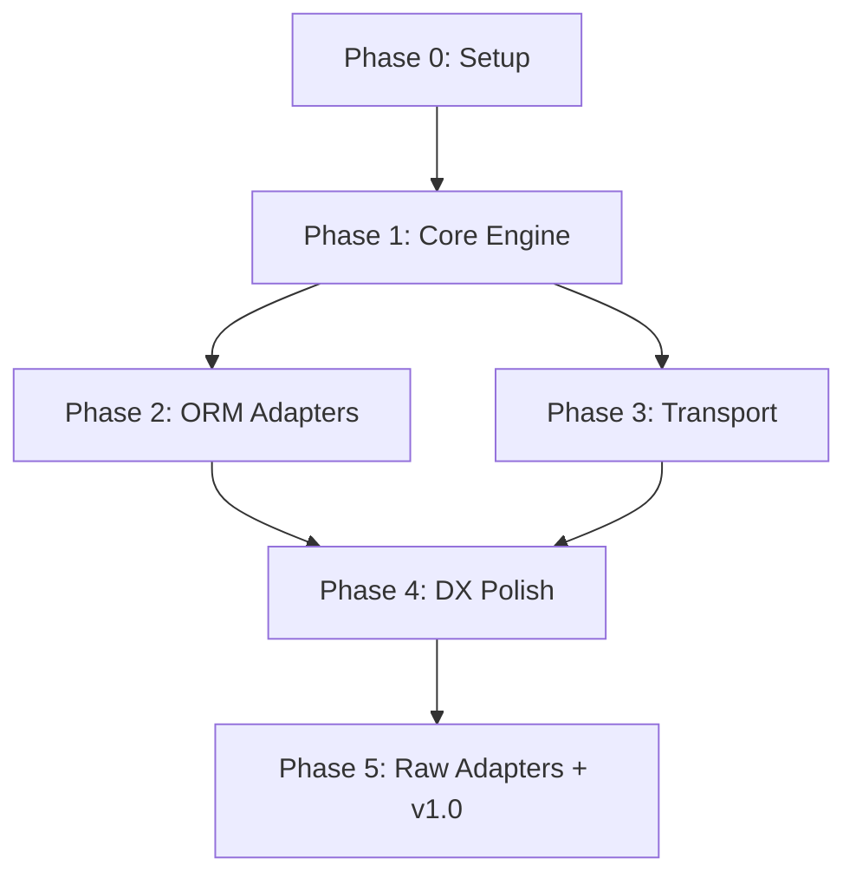

# 07 — Implementation Roadmap

> Phased milestones, deliverables, risk assessment, and dependency graph for `svelte-idb-sync`.

**← [06 API Design](./06-api-design.md)** | **[Back to README →](./README.md)**

---

## Phase Overview

```text
Phase 0 ──── Phase 1 ──── Phase 2 ──── Phase 3 ──── Phase 4 ──── Phase 5
 Prep         Core          Adapters      Transport     DX Polish    v1.0
              Engine        P+D           WS+SSE        Svelte        Publish
              ▲                                          ▲
              │                                          │
         Internal                                   Publishable
         testing                                     to npm
```

---

## Pre-Requisites (svelte-idb)

Before starting `svelte-idb-sync`, the core library needs these capabilities:

| Requirement                                      | Status   | Why                                                |
| ------------------------------------------------ | -------- | -------------------------------------------------- |
| `ChangeNotifier` is public API                   | ✅ Done   | Sync engine hooks into mutation events             |
| `Store` exposes `put`, `add`, `delete`, `getAll` | ✅ Done   | Sync applies server changes via Store API          |
| Stable types (`ChangeEvent`, `ChangeType`)       | ✅ Done   | Sync tracks operation types                        |
| `createDB()` allows extra IDB stores             | 🟡 Needed | Sync needs `__sync_oplog` and `__sync_meta` stores |

### Required Change to `svelte-idb`

The sync engine needs to create additional IDB stores (`__sync_oplog`, `__sync_meta`) inside the same database. Options:

**Option A: Extend `createDB()` config** (Recommended)
```typescript
const db = createDB({
  name: 'myapp',
  version: 2,
  stores: { users: { ... } },
  // NEW: Allow internal stores from plugins
  _internalStores: {
    __sync_oplog: { keyPath: 'id' },
    __sync_meta: { keyPath: 'key' },
  }
});
```

**Option B: Separate IDB database**
```typescript
// Sync uses its own database: "myapp__sync"
// Pro: No changes to svelte-idb needed
// Con: Can't use cross-store transactions with user data
```

> **Decision:** Start with Option B (zero changes to svelte-idb) and migrate to Option A later if cross-store transactions become necessary.

---

## Phase 0: Project Setup

**Goal:** Scaffolded package with tooling, types, and test infrastructure.

**Duration:** 1 week

### Deliverables

```
packages/svelte-idb-sync/        (or separate repo to start)
├── src/
│   ├── core/
│   │   └── types.ts             ← All sync type definitions
│   ├── adapters/
│   ├── transport/
│   ├── conflict/
│   └── svelte/
├── package.json
│   peerDependencies: { "svelte-idb": "^0.x" }
├── tsconfig.json
├── vitest.config.ts
└── README.md
```

### Tasks

- [ ] Initialize package with `npm init`
- [ ] Configure TypeScript, Vitest, `@sveltejs/package`
- [ ] Define all sync types (`SyncConfig`, `SyncAdapter`, `SyncTransport`, etc.)
- [ ] Set up peerDependency on `svelte-idb`
- [ ] Create package exports map (`/adapters/prisma`, `/svelte`, etc.)
- [ ] Write initial README with project vision

### Definition of Done
- `bun run check` passes
- All types compile without errors
- Package structure matches the architecture doc

---

## Phase 1: Core Sync Engine

**Goal:** Working push/pull sync loop with oplog, change tracking, and conflict resolution.

**Duration:** 3 weeks

### Deliverables

```typescript
// This should work after Phase 1:
import { createSync, httpTransport } from 'svelte-idb-sync';

const sync = createSync(db, {
  transport: httpTransport({ endpoint: '/api/sync' }),
  stores: { users: { sync: true } },
  conflict: 'server-wins',
});

// Mutations auto-track in oplog
await db.users.add({ name: 'Alice' });
// → oplog: [{ type: 'create', key: 1, status: 'pending' }]

// Manual push
await sync.pushNow();
// → POST /api/sync { action: 'push', payload: [...] }

// Manual pull
await sync.pullNow();
// → POST /api/sync { action: 'pull', payload: { cursor: null } }
```

### Tasks

- [ ] **`change-tracker.ts`** — Hook into `svelte-idb` ChangeNotifier, create SyncOperations
- [ ] **`oplog.ts`** — Persistent operation log in a separate IDB database
  - [ ] `addOperation(op)` — Write to oplog
  - [ ] `getPending()` — Read all pending ops
  - [ ] `markSynced(ids)` — Update status
  - [ ] `markFailed(ids, error)` — Update status with error
  - [ ] `collapse()` — Merge add+update, cancel add+delete pairs
- [ ] **`sync-state.ts`** — Cursor management, client ID, last sync timestamp
- [ ] **`sync-engine.ts`** — Orchestrator
  - [ ] `push()` — Read oplog → batch → send via transport → handle results
  - [ ] `pull()` — Send cursor → receive changes → apply to IDB → update cursor
  - [ ] `start()` / `stop()` — Lifecycle management
  - [ ] `pushNow()` / `pullNow()` — Force immediate sync
  - [ ] Auto-push on oplog changes (debounced)
  - [ ] Auto-pull on polling timer
- [ ] **`conflict-resolver.ts`** — Built-in strategies
  - [ ] `server-wins` — Accept server record
  - [ ] `client-wins` — Re-push with force
  - [ ] `last-write-wins` — Compare HLC timestamps
  - [ ] Custom function support
- [ ] **`hlc.ts`** — Hybrid Logical Clock implementation
- [ ] **Integration tests** — End-to-end push/pull with mock server

### Definition of Done
- Push tracks mutations and sends them to server
- Pull fetches changes and applies them to IDB
- Conflict resolution works for `server-wins`, `client-wins`, `lww`
- Oplog persists across page refreshes
- All tests pass

---

## Phase 2: ORM Adapters (Prisma + Drizzle)

**Goal:** First-class server-side adapters for Prisma and Drizzle.

**Duration:** 2 weeks

### Deliverables

```typescript
// Prisma adapter works:
import { createPrismaAdapter } from 'svelte-idb-sync/adapters/prisma';
const adapter = createPrismaAdapter(prisma, { storeMapping: { users: 'user' } });

// Drizzle adapter works:
import { createDrizzleAdapter } from 'svelte-idb-sync/adapters/drizzle';
const adapter = createDrizzleAdapter(db, { storeMapping: { users: usersTable } });
```

### Tasks

- [ ] **Prisma adapter**
  - [ ] `push()` — Create/update/delete via Prisma client
  - [ ] `pull()` — Query changes via Prisma with cursor pagination
  - [ ] Version checking for conflict detection
  - [ ] Authorization hook (`authorize` config)
  - [ ] Soft delete support (`deletedAt`)
- [ ] **Drizzle adapter**
  - [ ] Same API as Prisma adapter but using Drizzle query builder
  - [ ] Support for PostgreSQL dialect
  - [ ] Support for SQLite dialect (via `drizzle-orm/sqlite-core`)
- [ ] **Adapter test suite** — Shared test cases that all adapters must pass
- [ ] **Documentation** — Setup guides for both adapters

### Definition of Done
- Full end-to-end test: client → svelte-idb → sync engine → adapter → actual DB
- Both adapters handle create, update, delete, conflict detection
- Both adapters support authorization filtering

---

## Phase 3: Transport Layer

**Goal:** HTTP polling (production-ready) and WebSocket transport (real-time).

**Duration:** 2 weeks

### Tasks

- [ ] **HTTP transport** (Phase 1 has a basic version; now polish it)
  - [ ] Configurable polling interval
  - [ ] Exponential backoff retry
  - [ ] Request timeout handling
  - [ ] Dynamic headers (auth tokens)
  - [ ] Online/offline detection (`navigator.onLine` + fetch probe)
- [ ] **WebSocket transport**
  - [ ] Connection management with auto-reconnect
  - [ ] Heartbeat / keepalive
  - [ ] Server→client push (real-time change streaming)
  - [ ] Optional client→server push via WS
  - [ ] Auth token in connection
- [ ] **Transport interface tests** — Shared test suite

### Definition of Done
- HTTP transport handles offline gracefully and retries
- WebSocket transport auto-reconnects and streams changes
- Both transports pass the shared test suite

---

## Phase 4: DX Polish & Svelte Integration

**Goal:** Reactive Svelte bindings, `field-merge` conflict strategy, and developer experience.

**Duration:** 2 weeks

### Tasks

- [ ] **`syncStatus.svelte.ts`** — Reactive sync status (`$state`-backed)
  - [ ] `status.current` — synced | syncing | offline | error
  - [ ] `status.pendingCount` — Number of pending ops
  - [ ] `status.lastSyncedAt` — Last sync timestamp
  - [ ] `status.isOnline` — Browser online state
- [ ] **Field-merge conflict strategy**
  - [ ] Per-field HLC timestamps
  - [ ] Merge algorithm
  - [ ] `__meta` column support (server-side)
- [ ] **Debug logging** — `[svelte-idb-sync]` prefixed logs
- [ ] **Error types** — `SyncError`, `SyncNetworkError`, `SyncConflictError`, etc.
- [ ] **`reset()`** — Clear all sync state
- [ ] **`retry()`** — Retry failed operations
- [ ] **Visibility change handling** — Pause sync when tab is hidden
- [ ] **`beforeunload`** — Attempt final flush on tab close

### Definition of Done
- Svelte components can reactively show sync status
- Field-merge strategy works end-to-end
- Sync pauses/resumes on tab visibility changes
- All error types are defined and thrown correctly

---

## Phase 5: Raw SQL Adapters + v1.0 Release

**Goal:** Raw PostgreSQL and SQLite adapters, comprehensive docs, published to npm.

**Duration:** 2 weeks

### Tasks

- [ ] **Raw PostgreSQL adapter**
  - [ ] Uses `pg` pool
  - [ ] Parameterized queries (SQL injection safe)
  - [ ] Transaction wrapping
- [ ] **Raw SQLite adapter**
  - [ ] Uses `better-sqlite3`
  - [ ] Handles SQLite-specific limitations (no `RETURNING` in old versions)
- [ ] **Documentation**
  - [ ] Getting Started guide
  - [ ] Adapter-specific setup guides (Prisma, Drizzle, Raw PG, Raw SQLite)
  - [ ] Conflict resolution guide
  - [ ] API reference
- [ ] **Example app** — Full SvelteKit app with sync
- [ ] **CHANGELOG.md**
- [ ] **Publish to npm** as `svelte-idb-sync`

### Definition of Done
- All four adapters work and are documented
- Example app demonstrates full sync lifecycle
- Published on npm
- CI/CD pipeline green

---

## Post-Launch Roadmap

| Version | Feature                                  | Priority | Effort  |
| ------- | ---------------------------------------- | -------- | ------- |
| v1.1    | CRDT conflict plugin (Yjs integration)   | Medium   | 3 weeks |
| v1.2    | Server-Sent Events (SSE) transport       | Low      | 1 week  |
| v1.3    | Vite plugin companion (route generation) | Low      | 2 weeks |
| v1.4    | Turso / LibSQL adapter                   | Low      | 1 week  |
| v1.5    | Multi-tab sync coordination              | Medium   | 2 weeks |
| v2.0    | Schema validation / migration sync       | Medium   | 3 weeks |
| v2.1    | End-to-end encryption plugin             | Low      | 3 weeks |

---

## Dependency Graph



---

## Risk Assessment

| Risk                          | Likelihood | Impact | Mitigation                                           |
| ----------------------------- | ---------- | ------ | ---------------------------------------------------- |
| `svelte-idb` internals change | Low        | High   | Depend only on public API; add integration tests     |
| Oplog grows unbounded         | Medium     | Medium | Compact oplog after sync; max oplog size config      |
| Clock drift breaks LWW        | Medium     | Medium | Use HLC instead of wall-clock; document limitation   |
| Prisma API changes            | Low        | Medium | Pin to Prisma 5.x; abstract via adapter interface    |
| WebSocket reconnection storms | Low        | High   | Exponential backoff with jitter; max reconnect limit |
| Large datasets overwhelm sync | Medium     | High   | Cursor-based pagination; configurable batch sizes    |
| Concurrent tab conflicts      | Medium     | Medium | Phase 5 multi-tab coordination via BroadcastChannel  |

---

## Total Estimated Timeline

| Phase                        | Duration | Running Total |
| ---------------------------- | -------- | ------------- |
| Phase 0: Setup               | 1 week   | 1 week        |
| Phase 1: Core Engine         | 3 weeks  | 4 weeks       |
| Phase 2: ORM Adapters        | 2 weeks  | 6 weeks       |
| Phase 3: Transport           | 2 weeks  | 8 weeks       |
| Phase 4: DX Polish           | 2 weeks  | 10 weeks      |
| Phase 5: Raw Adapters + v1.0 | 2 weeks  | **12 weeks**  |

> **Total: ~12 weeks to v1.0**, assuming full-time focus. Phases 2 and 3 can run in parallel, potentially reducing to ~10 weeks.

---

**← [06 API Design](./06-api-design.md)** | **[Back to README →](./README.md)**
